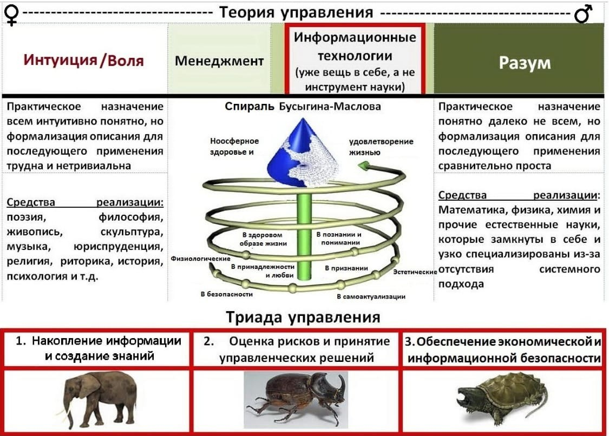

# Защита инфоманции 03.02.24

## Вводная лекция по защите инфомарции 

Уровни:
- государства
- корпорации
- личности

Восприятие информации:
- Визуальная
- Аудиальная
- Тактильная

Нет понятия экономической безопасности и информационной безопасности, это стороны одной медали

`Защита информации касается как материальных, так и нематериальных активов безопасности`

Информационная безопасность требует непрерывных реализуемых предприятий\организаций бизнес процессов

Модель безопасности СИА:
- Целостность
- Доступность
- Конфидециальность

Для обеспечения экономической безопасности занимается конкурентноспособностью предприятия и старается сохранить стоимость его активов.

Для Обеспечение экономической безопасности надо соблюдать комплекс мероприятий:
1) Организационно-правовые обеспечение организационно-прововое мероприятие
2) Программно-математическое обеспечение
3) Инженерно-техническое

Организация внутри организаций - Служба безопасности

Виды ограничеий и защита информации:
- Организационно-правовой (Департамент безопасности, разделение допусков)
- Программно-математическое обеспечение (мониторы, системы мониторинга, шифрование)
- Инженерно-технические (Стены, решётки, закрытые дороги)

### Работа с персоналом 

