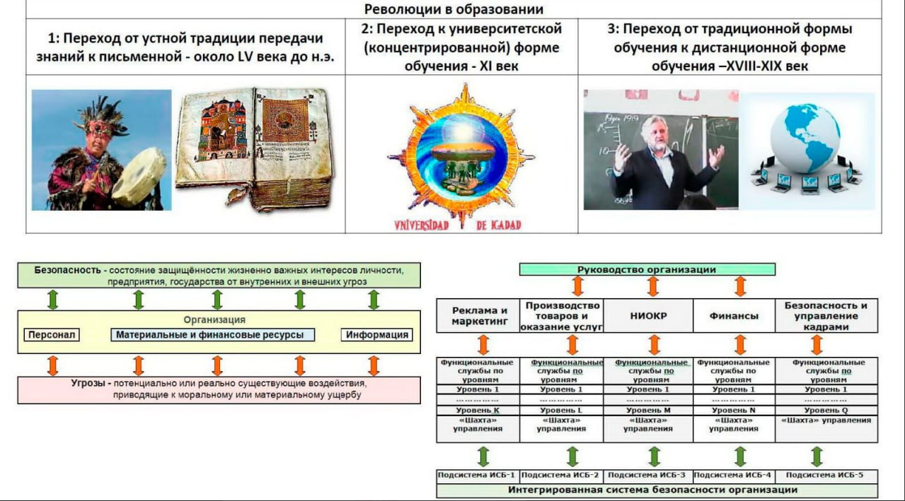

# Лекция 2

## Защита инфоманции 10.02.24

### Содержание курса

Курсы, необходимые для прохождения и содержание курса:
- Стеганография [Курс]()
- Информационная безопасность и защита информации [Курс]()
- Информационно юридическая защита

Допуск:
- Тесты в ЛМС по курсам (Положительные оценки)
- Лабораторные работы 
    - Метод Сати
    - Модель угроз и матрица нарушени

#### Лекция

Виды угроз: 
- Внешняя угроза 
    - Землятресения
    - хакеры 
    - сожгли ЦОД
- Внутренняя угроза 
    - Сотрудника спровоцировали сделать уязвимость через социальную инженерию
    - Письма с троянами

Иерархия ифнормации:
- мудрость
- знания
- данные
- информация

