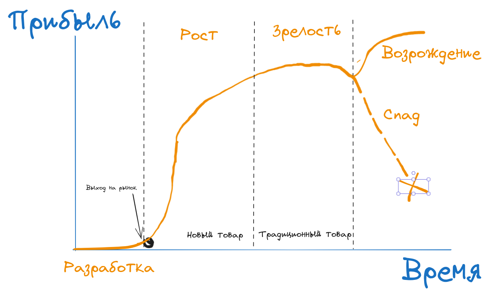
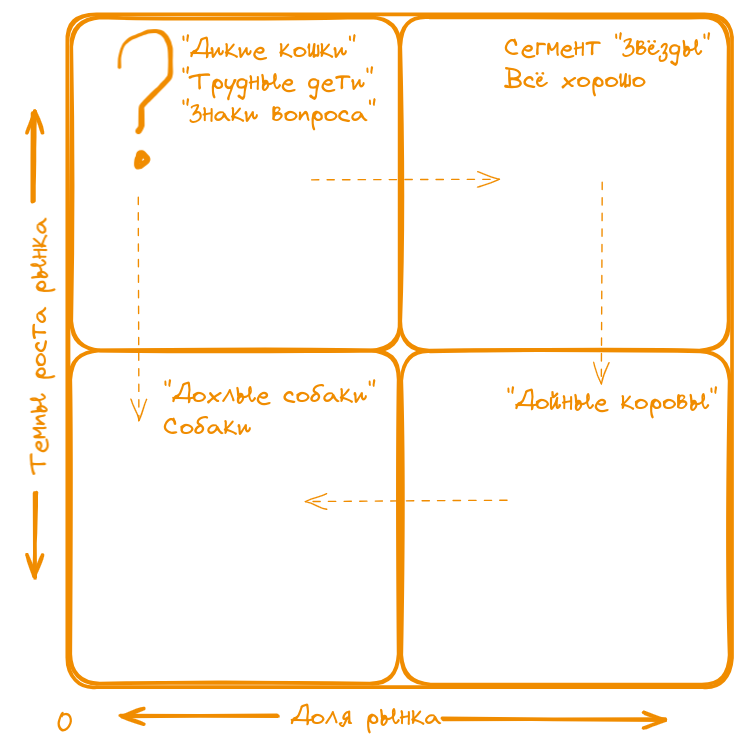
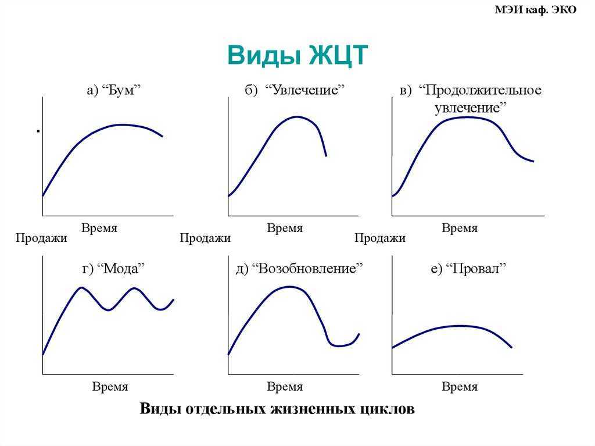
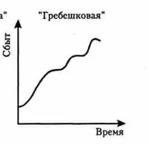

# Жизенный цикл

ЖЦТ - Жизненный цикл товара

### Этапы ЖЦТ:
- разработка (Нет прибыли) -> товар выходит на рынок
- рост (возможен спад или этап зрелости) 
- этап спада/возрождения (Либо популярность товара падает, либо в товар воодятся инновации)

#### Асортименты бывают широкие и глубокие:
1) Широкий - много разновидностей кисломолочных продуктов
2) Глубокий - много разновидностей вкусов йогурта

### Матрица БКГ - Бостонская Консалтинговая Группа

Сегменты:
- Звёзды (всё хорошо, рынок растёт, доля прожаж большая)
- Проблемные дети, дикие кошки, знаки вопроса (Может как спать объём продаж, так и вырасти)
- Дойные коровы (рынок не растёт, необходимо максимально поднять выручку)
- Дохлые собаки

#### Виды ЖЦТ
- Бум(быстрый набор популярности и долгое плато)
- Увлечение 
- Продолжительное увлечение
- Мода/Сезонность (пики и спады периодичны)
- Возобновление/возрождение/ностальгия
- Гребешковая
- Провал

