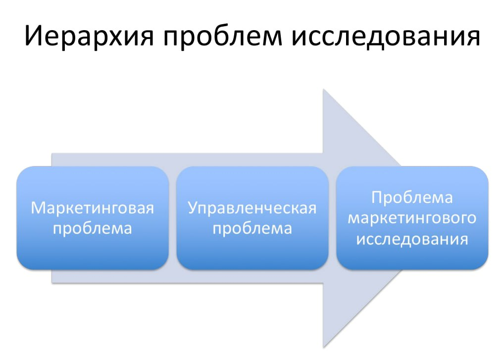

# Лекция 2

## Составление опросника для качественного иследования

### Виды исследований:

- Полевые (По первичным данным)
- Кабинетные  (По вторичным данным)

#### Теория мативации
- X\Y
- Гигиенические
- Мотивационные

#### Категоризация информации
- Достоверная 
- Вероятностно достоверная
- Недостоверная
- Ложная 

Особенности сбора первичной информации:

- Дороговизна
- Сложность сбора
- Можно взять вторичную информацию
    - Устареваемость

#### Типы маркетинговых исследований:
- разведывательные
- описательные
- 
- Экперементальные (Эмперические)

